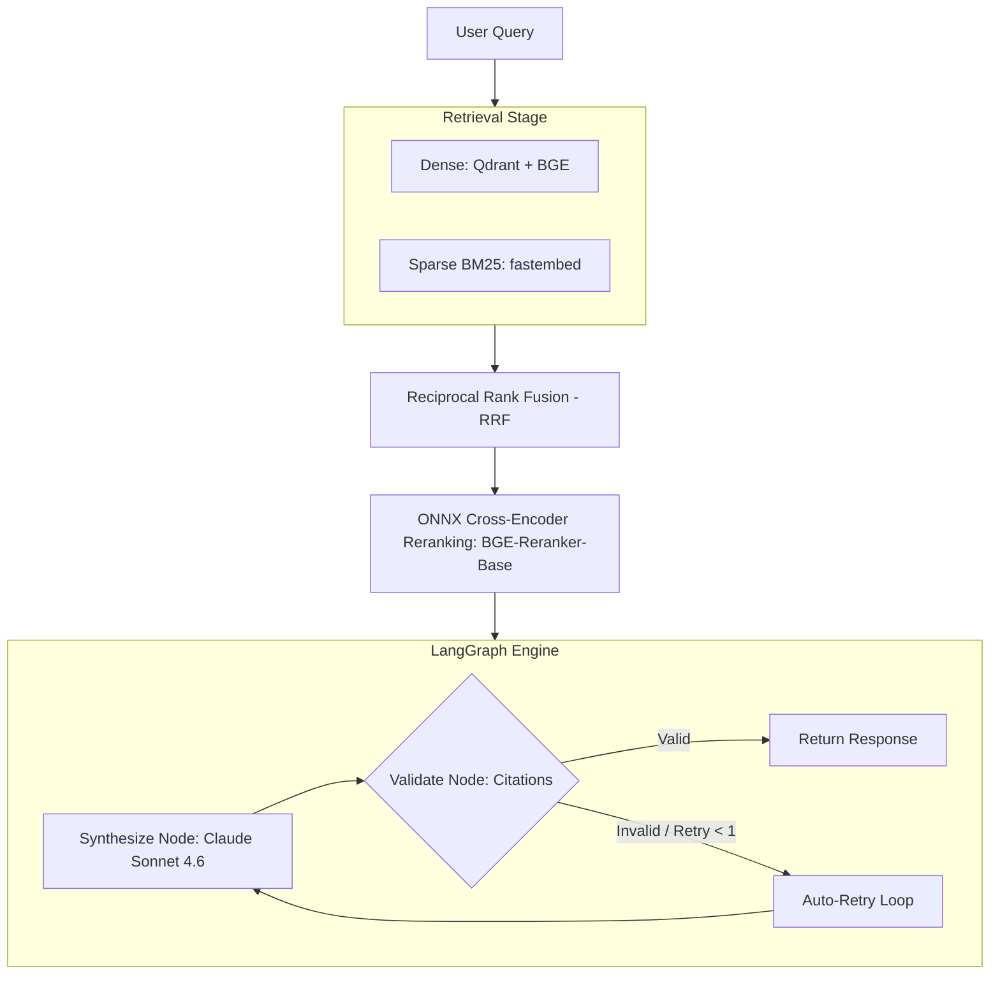

# retrievault

Production-grade citation-backed RAG service over the FastAPI codebase.

[](https://github.com/momtazularefin/retrievault/actions)
[](https://github.com/momtazularefin/retrievault/blob/main/LICENSE)
[](https://python.org)

## What It Does

Retrievault answers natural-language questions about the FastAPI codebase with grounded, citation-backed answers. Every factual claim is bound to exact source files and line ranges that link directly to GitHub. 

If a query is out-of-scope or unanswerable from the context, the engine cleanly refuses to answer rather than fabricating code claims or hallucinations.

## Architecture

Retrievault implements AST-aware python code ingestion, dense + sparse hybrid retrieval with rank fusion, and an agentic validation loop inside LangGraph.



For a detailed explanation of our ingestion boundaries, rank fusion math, and agentic error-correction loop, see [Architecture & Design →](docs/architecture.md).

## Evaluation & Benchmark Results

Milestone 8 is in progress. The latest local smoke report was generated on 2026-07-03 from 5 queries (3 factual + 2 refusal), using `claude-sonnet-4-6` for synthesis and `gpt-4o-mini` as the judge. It does **not** pass the AC4/AC5 gates yet.

| Metric | Target | Latest Smoke Result | Status |
|--------|--------|---------------------|--------|
| **Faithfulness** | >= 0.85 | **0.00** | Fail |
| **Context Precision** | >= 0.70 | **0.00** | Fail |
| **Answer Relevancy** | >= 0.80 | **0.00** | Fail |
| **Citation Validity** | == 1.00 | **1.00** | Pass |
| **Refusal Correctness** | >= 0.90 | **1.00** | Pass |
| **P50 Latency** | <= 3.0s | **7.70s** | Fail |
| **P95 Latency** | <= 8.0s | **12.03s** | Fail |
| **Cost / Query** | <= $0.06 | **$0.0037** | Pass |

For the report source and metric definitions, see [Evaluation & Benchmarks Reference](docs/evaluation.md) and `backend/eval/reports/report.md`.

## Quickstart

For a step-by-step developer setup guide starting from a completely empty laptop, refer to the **[Getting Started & Operations Guide →](docs/getting-started.md)**.

Otherwise, get Retrievault up and running locally in under 5 minutes:

### 1. Clone & Install Dependencies
Ensure you have `uv` installed, then run:
```bash
git clone https://github.com/momtazularefin/retrievault.git
cd retrievault/backend
uv sync --all-extras
```

### 2. Configure Environment
Copy the example environment template and populate your Anthropic API Key:
```bash
cp ../.env.example ../.env
# Edit ../.env and add your ANTHROPIC_API_KEY
```
For a detailed description of all configurations, see the [Configuration Reference →](docs/configuration.md).

### 3. Spin Up Vector Store & Index Code
Start the Qdrant service via Docker and ingest the pinned `fastapi` codebase package:
```bash
docker compose -f ../docker-compose.yml up -d qdrant
uv run python -m retrievault.ingest
```

### 4. Run the API & Frontend
Launch the FastAPI backend server:
```bash
uv run uvicorn retrievault.api:app --reload
```
In another terminal, launch the Next.js chat interface:
```bash
cd ../frontend
npm install
npm run dev
```

### 5. Run the Evaluation Harness
Execute the async parallelized evaluation loop to verify system performance:
```bash
cd ../backend
uv run python -m retrievault.eval
```

## Stack

| Component | Technology | Version / Model |
|-----------|------------|-----------------|
| **RAG Runtime** | Python | `3.12` |
| **Database** | Qdrant | `qdrant/qdrant:latest` local Docker image |
| **Embeddings** | BGE Base | `BAAI/bge-base-en-v1.5` |
| **Reranker** | BGE Reranker via ONNX Runtime | `BAAI/bge-reranker-base` |
| **Agent Framework** | LangGraph | `0.1` |
| **Synthesis LLM** | Claude | `claude-sonnet-4-6` |
| **Frontend** | Next.js | `16.2.9` |

## Project Structure

```text
├── backend/                  # Python API & Search Engine
│   ├── retrievault/          # Core RAG source code
│   │   ├── retrieve/         # Dense, sparse & fusion retrieval
│   │   ├── rerank/           # Reranking wrapper
│   │   └── synthesize/       # LangGraph state machine & prompts
│   ├── eval/                 # Evaluation dataset & reports
│   └── pyproject.toml        # uv dependency configuration
├── frontend/                 # Next.js 16.2.9 Tailwind Chat UI
├── docs/                     # Developer reference documentation
└── docker-compose.yml        # Qdrant local container configuration
```

## Deeper Documentation

* **[Getting Started & Operations](docs/getting-started.md)** — Clean machine environment setup, code checkouts, local run instructions, and code change management guides.
* **[Architecture & Design](docs/architecture.md)** — Ingestion boundaries, rank fusion, and agentic error-correction state machine.
* **[Configuration Guide](docs/configuration.md)** — Reference table of all environment configurations and recommended concurrency parameters.
* **[Evaluation Harness](docs/evaluation.md)** — Metric definitions, grounding heuristics, and cache-resumption controls.

## License

This project is licensed under the MIT License - see the [LICENSE](LICENSE) file for details.
