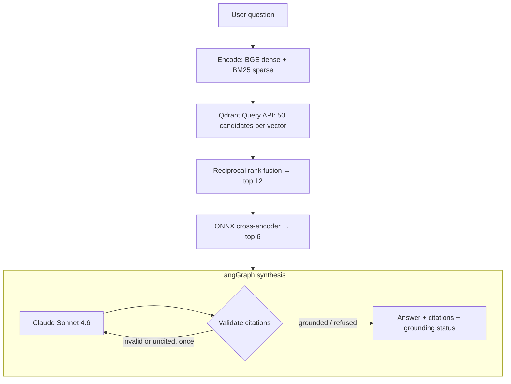

# RetrieVault

Citation-backed question answering over the FastAPI codebase. Every claim in an answer points at
the exact file and lines it came from; a question the source does not answer is refused, not
guessed.

[](https://github.com/momtazularefin/retrievault/actions)
[](LICENSE)
[](https://python.org)

## What it does

Ask "how does `APIRouter.include_router` combine prefixes?" and get an answer whose every
sentence carries a link into `fastapi/routing.py` at the lines that support it, at the pinned
release tag. Ask about Celery and it says it could not find that in the retrieved source.

Three properties the system holds itself to:

- **A citation is exact.** A chunk's text is exactly the source lines its citation names — checked
  for all 838 indexed chunks, with no overlaps and no line belonging to two chunks.
- **A refusal is a fact, not a guess.** The model is required to open a refusal with one fixed
  sentence, so the API reports `refused: true` deterministically instead of scanning for the word
  "cannot".
- **Every answer reports its own grounding.** `grounded`, `refused`, `invalid_citations`,
  `uncited`, or `truncated` — failure modes are surfaced, not smoothed over.

## Architecture



Chunking is AST-aware: definitions stay whole while they fit a size budget, a large class becomes
a header chunk plus one chunk per method (each citing its own lines), and an oversized function is
split at parameter and statement boundaries. Details, and the reasoning behind each stage, in
[Architecture & Design →](docs/architecture.md).

## Evaluation

Measured, published, and not passing every gate. The numbers below come from
`backend/eval/reports/report.md`, produced by one command against the real service.

| Metric | Target | Measured | |
|---|---|---|---|
| Faithfulness (Ragas) | >= 0.85 | **0.91** | Pass |
| Context precision (Ragas) | >= 0.70 | **0.70** | Pass |
| Answer relevancy (Ragas) | >= 0.80 | **0.84** | Pass |
| Citation validity | = 1.00 | **1.00** | Pass |
| Refusal correctness | >= 0.90 | **1.00** | Pass |
| Cost per query | <= $0.06 | **$0.0090** | Pass |
| P50 latency | <= 3.0 s | **8.70 s** | **Fail** |
| P95 latency | <= 8.0 s | **14.14 s** | **Fail** |

50 queries (45 answerable, 5 refusal probes) against the running service, one at a time, on
laptop CPU. Zero failed requests, zero unscored judge jobs, and zero answers needing a corrective
retry. Two answerable questions were refused where retrieval missed — a refusal, not a
fabrication. Dataset v1.1, judge `claude-haiku-4-5-20251001`, index of 838 chunks at chunker v2.

**The latency gates fail, and the breakdown says why.** Stage P50: retrieve 0.04 s, rerank 3.10 s,
synthesize 5.69 s. Generation alone is roughly twice the 3-second P50 target, which was set during
planning before anything had been measured. The honest options are streaming (moving the
user-visible number to time-to-first-token), turning off the reranker (measured as equal quality on
this corpus, saving about 3 s), a GPU (rerank drops to 1.7 s), or a smaller synthesis model. None
was applied here, because this run is the baseline they would be measured against.

Context precision landing exactly on its threshold is worth treating as a coin flip rather than a
pass: repeated runs of the same configuration varied by about 0.03 on the judged metrics.

Full metric definitions, the reranker measurement, and the known limits of this dataset are in
[Evaluation →](docs/evaluation.md).

## Quickstart

Requires Docker, [uv](https://docs.astral.sh/uv/), Node 24, and an Anthropic API key. The
step-by-step version, from an empty machine, is the
[Getting Started guide →](docs/getting-started.md).

```bash
git clone https://github.com/momtazularefin/retrievault.git
cd retrievault
cp .env.example .env            # add ANTHROPIC_API_KEY

docker compose up -d qdrant     # vector store

cd backend
uv sync --all-extras
uv run python -m retrievault.ingest       # ~840 chunks; downloads ~1.2 GB of ONNX models once
uv run uvicorn retrievault.api:app --port 8000

cd ../frontend && npm install && npm run dev    # http://localhost:3000
```

`GET /health` reports whether the index is complete and which chunker built it; the UI reads the
same endpoint, so it cannot misreport the model or corpus it is talking to.

## Stack

| Component | Choice | Version / model |
|---|---|---|
| Runtime | Python | 3.12 |
| Vector store | Qdrant | `v1.18.2`, named dense + sparse vectors, server-side RRF |
| Dense embeddings | BGE base (int8 ONNX via fastembed) | `BAAI/bge-base-en-v1.5` |
| Sparse | BM25 via fastembed, IDF applied by Qdrant | `Qdrant/bm25` |
| Reranker | Cross-encoder, ONNX Runtime | `BAAI/bge-reranker-base` |
| Orchestration | LangGraph | 1.2.x |
| Synthesis | Claude | `claude-sonnet-4-6` |
| Evaluation | Ragas + a fixed judge | judge `claude-haiku-4-5-20251001` |
| Frontend | Next.js | 16.2.9 |

Serving needs none of torch, transformers, or optimum: all three local models come from fastembed
through one ONNX Runtime.

## Project structure

```text
backend/
  retrievault/         chunker, ingest, retrieve, rerank, synthesize, api, eval
  eval/                curated dataset, paraphrase probe, generated reports
  tests/               71 tests, 3 of them against a live Qdrant
frontend/              Next.js chat UI
docs/                  architecture, configuration, evaluation, getting started
docker-compose.yml     pinned Qdrant + backend
```

## What I would do next

- **Deploy it.** There is no public demo. The intended shape is the backend on Fly.io, Qdrant on a
  small node with a volume, the frontend on Vercel.
- **Stream the answer.** Synthesis is the dominant latency; streaming moves the user-visible number
  to time-to-first-token, which is the honest fix for a chat interface.
- **Parent-document retrieval.** Match on small chunks, then send the enclosing symbol when it fits
  a token budget — precision of small chunks, context of whole functions.
- **Zero-downtime re-index** through a collection alias, instead of rebuilding in place.
- **A larger, independently written evaluation set.** The current 45 answerable questions were
  model-generated and then hand-corrected against the source; most name the symbol they ask about,
  which flatters lexical retrieval.

## Documentation

- [Architecture & Design](docs/architecture.md) — chunking invariants, fusion, reranking, the
  synthesis graph, and what the grounding guarantee does and does not prove.
- [Evaluation](docs/evaluation.md) — metric definitions, current results, and the reranker
  measurement.
- [Configuration](docs/configuration.md) — every environment variable.
- [Getting Started](docs/getting-started.md) — clean-machine setup, running, checks, teardown.

## License

MIT — see [LICENSE](LICENSE).
