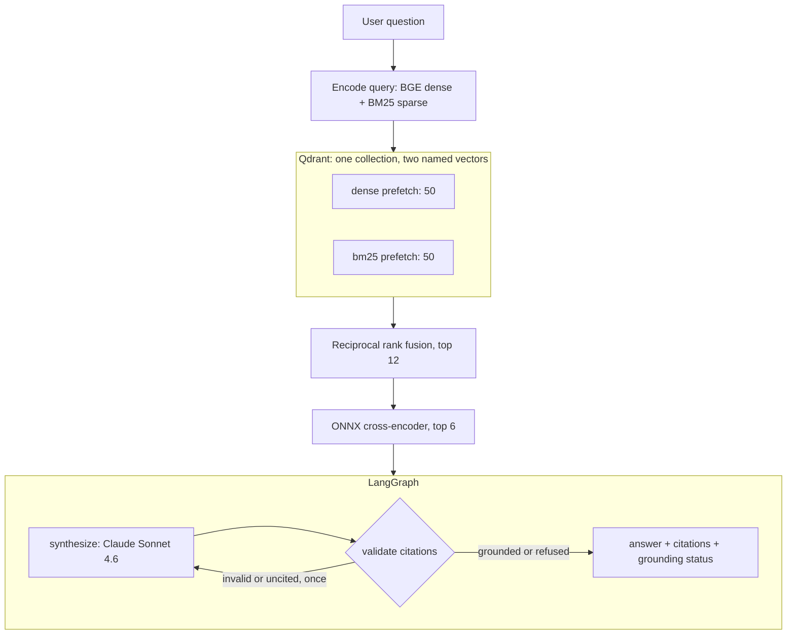

# RetrieVault Architecture & Design

How the system is built: the indexing pipeline, hybrid retrieval, reranking, and grounded
synthesis. Measurements behind the design choices are in [evaluation.md](evaluation.md).

---

## System overview

Two planes. The **indexing pipeline** runs offline, once per corpus tag. The **query service**
answers questions against the index it produced.



---

## 1. Indexing: AST-aware chunking

Chunking decides what a citation can point at, so the chunker has one hard rule: **a chunk's
text is exactly the source lines its span names**. `code` equals lines `start_line..end_line` of
`file_path`, which is what makes the GitHub link in a citation show the text the model read.

Three invariants, asserted in the tests and checked across the whole corpus:

- a chunk's `code` is exactly its span,
- spans never overlap,
- every non-blank line of a parseable file belongs to exactly one chunk.

The rules:

- **Definitions are kept whole while they fit the budget** (1,400 characters). A function, a
  class, or a method is one chunk, decorators and leading comments included.
- **A large class** becomes a chunk for its header, docstring, and class-level attributes, plus
  one chunk per method. A method's span is its own lines; the class signature travels with it as
  `context`, which is shown to the model but is not part of the cited span.
- **A large function** is split at parameter boundaries and statement boundaries: a parameter is
  never separated from its default, and a statement is never cut in half. An oversized compound
  statement (a nested function, `if`, `try`, loop) is split into the statements inside it.
- **Module-level statements** — imports, module docstring, `if TYPE_CHECKING:` blocks,
  assignments — are grouped into contiguous runs under the symbol `__module__`.
- A single simple statement larger than the budget stays whole. On FastAPI 0.136.3 that is 5
  chunks out of 838 (0.6%).

The budget exists because both local models truncate at 512 tokens: anything past that is
invisible to retrieval. At the densest 5% of this corpus (3.2 characters per token), 1,400
characters plus the header stays inside the window.

Each chunk is embedded as `file_path :: symbol_name`, then its context, then its code, so the
location is part of what both the embedder and the reranker see.

**Storage.** One Qdrant collection, one point per chunk, with a `dense` vector (BGE, 768
dimensions, cosine) and a `bm25` sparse vector. The payload carries `file_path`, `symbol_name`,
`symbol_type`, `start_line`, `end_line`, `code`, `context`, `part`, `part_count`, `repo`,
`commit_tag`, and a line-anchored `github_url`. The point id is a hash of file, span, and tag.

**The index manifest** is a payload-only point in the same collection: corpus tag, archive
SHA-256, chunk count, chunker version, models, and timestamp. It has no vectors, so no search
ever returns it, and because it is written last, its presence means the build finished.
`/health` reads it, so the service reports the provenance of the index it is actually querying
rather than of a file sitting next to the code.

---

## 2. Hybrid retrieval and rank fusion

For each query the service encodes both representations and sends one Qdrant Query API request
with two prefetches, fused server-side:

1. **Dense** — `BAAI/bge-base-en-v1.5` through fastembed (an int8-quantised ONNX export).
2. **Sparse** — `Qdrant/bm25`: tokenisation, stemming, and hashing in the client; Qdrant applies
   the IDF term at query time, which is why the sparse vector is configured with the IDF
   modifier. Without that modifier the score is raw term frequency, not BM25.
3. **Fusion** — reciprocal rank fusion. Qdrant scores a point as the sum over prefetches of
   `1 / (k + rank)` with `k = 2` and rank counted from zero, so agreement near the top of both
   lists dominates. That `k` is Qdrant's, not the `k = 60` of the original RRF paper.

Queries are encoded with fastembed's `query_embed`, not `embed`. For BM25 the two differ: the
document side carries term-frequency saturation and length normalisation, while the query side
is term presence with weight 1. Encoding a query as a document double-counts repeated words.

---

## 3. Cross-encoder reranking

The fused candidates are scored by `BAAI/bge-reranker-base` through fastembed, which loads
BAAI's own ONNX export. A cross-encoder reads the query and the chunk together, so it can judge
relevance a bi-encoder cannot — at the cost of one forward pass per candidate. Logits are mapped
through a sigmoid into (0, 1) as `rerank_score`, and the top `TOP_K_RERANK` chunks go to the
model.

Two things this project measured rather than assumed, both in [evaluation.md](evaluation.md):

- The candidate pool is 12, not 30. A deeper pool scored no better and cost 3.6x the time.
- On the evaluation set the reranker does not beat plain fusion. It stays on by default, and
  `RERANK_ENABLED=false` runs the measured alternative.

`ACCELERATION` selects the execution provider: `none` (CPU), `gpu` (CUDA, ROCm, or DirectML),
`npu` (Vitis AI). A requested accelerator that is absent raises, and the session is re-checked
after creation, because ONNX Runtime falls back to the CPU on its own and only warns. DirectML
is a GPU path — on an AMD Ryzen AI laptop it runs on the Radeon iGPU, not the NPU — so it is not
accepted as an NPU. BM25 has no ONNX session at all, so acceleration does not apply to it.

---

## 4. Grounded synthesis (LangGraph)

```
synthesize -> validate -> (one corrective retry) -> END
```

Retrieval and reranking stay outside the graph; it receives the question and the chunks.

- **Prompt shape.** The system prompt is static: use only the sources, cite each claim with the
  label of its chunk, refuse with one fixed sentence when the sources do not answer. The sources
  and the question go in the user turn, sources first and question last. Labels are positional:
  `[S1]` is the first chunk given.
- **The conversation carries the question.** `messages` starts with the user turn that holds the
  sources and the question, so a retry re-sends the whole exchange plus the correction. (An
  earlier version appended only the model's answer, so the retry asked the model to fix a
  citation without telling it what the question had been.)
- **Validation** is mechanical, and this is the honest limit of the guarantee: it checks that
  every `[S#]` resolves to a chunk that was actually supplied, not that the chunk supports the
  sentence. Grouped labels (`[S1, S3]`) are normalised to `[S1][S3]` so each one is linkable.
- **One corrective retry** fires for a label that does not exist, or for a substantive answer
  that cites nothing at all.
- **The outcome is reported, never hidden.** Every answer carries a `grounding.status`:
  `grounded`, `refused`, `invalid_citations` (a label still did not resolve; the valid citations
  are kept and the bad labels are listed), `uncited`, or `truncated` (the answer hit
  `max_tokens`). The UI shows a warning for anything other than the first two.
- **Refusal is a flag, not a guess.** The model is told to open a refusal with one exact
  sentence, so the API can report `refused: true` deterministically instead of scanning for
  words like "cannot".
- **No prompt caching.** Every query carries different sources, so a cache write (1.25x the
  input price) would almost never be read back, and the static system prompt is below the
  1,024-token minimum Sonnet 4.6 needs to cache at all.

---

## 5. The API

`POST /query` returns `answer`, `citations`, `refused`, `grounding`, and `metadata`
(per-stage latency, token counts by type, estimated cost, retrieved chunk ids and text).

The endpoint is async, but encoding, the Qdrant client, and ONNX inference are blocking calls;
they run in a worker thread, so one query's CPU work does not stall the event loop for every
other request. Question length and `top_k` are bounded at the schema. An unreachable Qdrant
maps to 503 and a failing Anthropic call to 502, rather than a stack trace.

Cost is computed from all four token counters — uncached input, output, cache writes at 1.25x,
cache reads at 0.1x. Counting only `input_tokens` would understate a cached request severalfold.

`GET /health` reports Qdrant reachability, whether the index is complete (manifest chunk count
plus one equals the point count), the synthesis model, the corpus manifest, and a build hash of
the Python sources.
