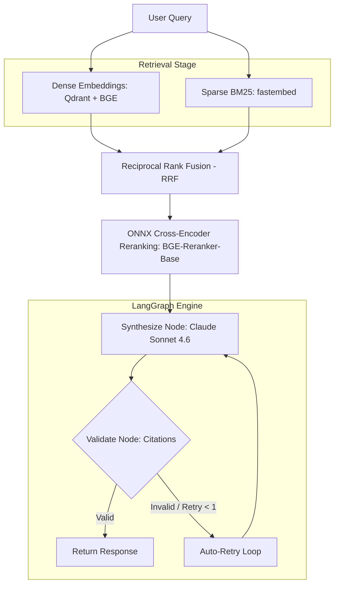

# Retrievault Architecture & Design

This document details the core architectural components of Retrievault, explaining the pipelines for ingestion, hybrid retrieval, reranking, and citation-backed synthesis.

---

## System Overview

Retrievault is a citation-backed Retrieval-Augmented Generation (RAG) system built over the FastAPI codebase. Its primary goal is to answer developer questions with high precision and provide verifiable citations (exact file paths and line numbers) for every claim.

---

## 1. Ingestion & In-Memory AST Chunking

To preserve syntactic meaning, Retrievault avoids naive character or token splitting. It uses an AST-aware parser to chunk Python source files:
* **Function & Class Level Boundaries**: Code is parsed into abstract syntax trees to locate class and function declarations. This guarantees that individual functions and classes remain contiguous inside a single chunk.
* **Metadata Extraction**: Each chunk retains the source file path, starting/ending line spans, symbol names, and symbol types (e.g., `class`, `function`).
* **Storage**: Chunks are stored in a Qdrant collection, indexing both the dense vector representation and the sparse token index.

---

## 2. Hybrid Retrieval & Rank Fusion (RRF)

For any query, Retrievault performs a dual-retrieval query to ensure both semantic and keyword matching:
1. **Dense Search**: Semantic matching is performed by embedding the query using `BAAI/bge-base-en-v1.5` and querying Qdrant.
2. **Sparse Search**: Keyword/lexical matching is performed by tokenizing the query via `Qdrant/bm25` (fastembed) and querying Qdrant.
3. **Reciprocal Rank Fusion (RRF)**: The two candidate lists are merged using the RRF algorithm, which scores candidates based on their reciprocal rank in both lists to ensure balanced, robust relevance.

---

## 3. ONNX Cross-Encoder Reranking

After Rank Fusion, the top candidates (configured by `PREFETCH_LIMIT` and `TOP_N_FUSION`) are passed to a local Cross-Encoder reranker (`BAAI/bge-reranker-base`):
* Unlike Bi-Encoders, the Cross-Encoder processes the query and the code chunk together, calculating an attention-based relevance score.
* Reranking filters the fused list down to the final `TOP_K_RERANK` (default: 6) chunks passed to the LLM.
* The reranker runs through ONNX Runtime. `ACCELERATION` controls hardware acceleration (`none` for CPU-only, `gpu`, or `npu`). When `gpu` or `npu` is selected and the required provider is unavailable, the system raises — there is no silent fallback.
* The ONNX export/cache directory is controlled by `RERANK_MODEL_DIR` and is generated locally. It must stay out of git.

---

## 4. Agentic Synthesis Pipeline (LangGraph)

Synthesis is managed as a stateful graph using LangGraph:
* **Synthesize Node**: Constructs a grounding system prompt containing the top-k chunks labeled as `[S1]`, `[S2]`, etc. It calls Claude Sonnet 4.6 to draft the response.
* **Validate Node**: The generated answer is parsed to extract all `[S#]` citations. It verifies that:
  1. Every citation resolves to a valid chunk provided in the context.
  2. The citations match the actual code chunks (preventing hallucinations).
* **Auto-Retry Node**: If the validator flags invalid or hallucinated citations, it injects a corrective feedback message and routes back to the Synthesize node for a second attempt (capped at 1 retry).
